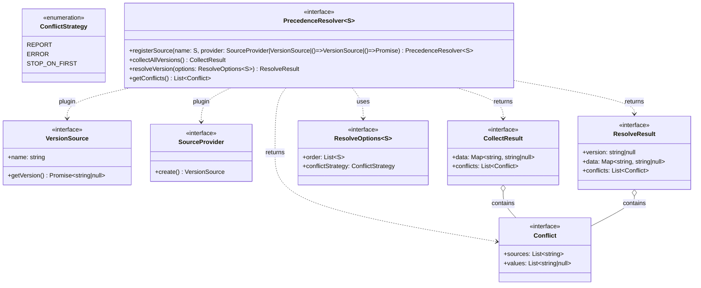

# Precedence Resolver Design

## Overview
**Original Purpose:**
The Precedence Resolver was originally designed to determine the Node.js version to use in a project by consulting multiple sources (e.g., `.nvmrc`, `package.json`, CI/CD YAML files).

**Current Design:**
The Precedence Resolver has evolved into a generic, source-agnostic orchestration system. It can be used to infer or resolve any value from multiple, pluggable sources, with configurable precedence and conflict handling. This makes it suitable for a wide range of use cases beyond Node.js version inference, such as resolving configuration values, environment settings, or any scenario where multiple sources of truth must be orchestrated and conflicts managed.

The design supports extensibility, runtime configuration, and granular conflict handling, making it adaptable for future needs and other domains.

## Key Features
- **Pluggable sources:** Register any number of sources implementing a common interface.
- **Configurable precedence:** Specify the order in which sources are checked at runtime.
- **Granular conflict handling:** Define conflict strategies globally or per source pair.
- **Separation of concerns:** Methods for collecting all possible versions and for resolving the final version.
- **Extensible resolver:** The resolver itself is an interface, allowing for multiple strategies/implementations.

## Interfaces (Mermaid UML)

**Note:**
S is a generic type parameter that should extend `string` and represents the set of valid source names. It is used for both registering sources and specifying the order in `ResolveOptions~S~`
## Example Usage (TypeScript)
```ts
const resolver: PrecedenceResolver = new MyPrecedenceResolver();
// Register by instance
resolver.registerSource("nvmrc", new NvmrcSource());
// Register by sync factory
resolver.registerSource("packageJson", () => new PackageJsonSource());
// Register by async factory
resolver.registerSource("ciYaml", async () => new CiYamlSource(".github/workflows/ci.yml", "steps.data.input.node_version"));

// Collect all possible versions
const allVersions = await resolver.collectAllVersions();
// {
//   data: { nvmrc: "18.16.0", packageJson: "18.12.0", ciYaml: null },
//   conflicts: [
//     {
//       sources: ["nvmrc", "packageJson"],
//       values: ["18.16.0", "18.12.0"]
//     }
//   ]
// }

// Resolve the final version with runtime options
const result = await resolver.resolveVersion({
  order: ["nvmrc", "packageJson", "ciYaml"],
  conflictStrategy: "warn",
  stopOnFirst: false
});
// result = {
//   version: "18.16.0",
//   data: { nvmrc: "18.16.0", packageJson: "18.12.0", ciYaml: null },
//   conflicts: [
//     {
//       sources: ["nvmrc", "packageJson"],
//       values: ["18.16.0", "18.12.0"]
//     }
//   ]
// }
```

## Notes
- New sources can be added without modifying the resolver implementation (open/closed principle). Register sources by name (generic extending string) and either an instance, a sync factory, or an async factory for maximum flexibility and plugin-style extensibility.
- Different resolver implementations can be created for different strategies (e.g., always pick highest, always stop on first, etc).
- If a source in the order is not registered, the implementation should either throw an error, warn, or report, depending on the desired strictness. This should be considered in the implementation and configuration.
