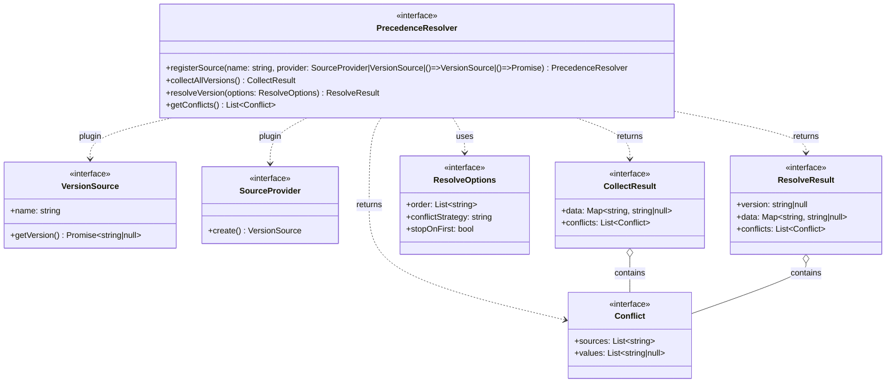

# Precedence Resolver Design

## Overview
The Precedence Resolver is responsible for determining the Node.js version to use in a project by consulting multiple sources (e.g., `.nvmrc`, `package.json`, CI/CD YAML files). It supports extensibility, runtime configuration, and granular conflict handling.

## Key Features
- **Pluggable sources:** Register any number of sources implementing a common interface.
- **Configurable precedence:** Specify the order in which sources are checked at runtime.
- **Granular conflict handling:** Define conflict strategies globally or per source pair.
- **Separation of concerns:** Methods for collecting all possible versions and for resolving the final version.
- **Extensible resolver:** The resolver itself is an interface, allowing for multiple strategies/implementations.

## Interfaces (Mermaid UML)


## Example Usage (TypeScript)
```ts
const resolver: PrecedenceResolver = new MyPrecedenceResolver();
// Register by instance
resolver.registerSource("nvmrc", new NvmrcSource());
// Register by sync factory
resolver.registerSource("packageJson", () => new PackageJsonSource());
// Register by async factory
resolver.registerSource("ciYaml", async () => new CiYamlSource(".github/workflows/ci.yml", "steps.data.input.node_version"));

// Collect all possible versions
const allVersions = await resolver.collectAllVersions();
// {
//   data: { nvmrc: "18.16.0", packageJson: "18.12.0", ciYaml: null },
//   conflicts: [
//     {
//       sources: ["nvmrc", "packageJson"],
//       values: ["18.16.0", "18.12.0"]
//     }
//   ]
// }

// Resolve the final version with runtime options
const result = await resolver.resolveVersion({
  order: ["nvmrc", "packageJson", "ciYaml"],
  conflictStrategy: "warn",
  stopOnFirst: false
});
// result = {
//   version: "18.16.0",
//   data: { nvmrc: "18.16.0", packageJson: "18.12.0", ciYaml: null },
//   conflicts: [
//     {
//       sources: ["nvmrc", "packageJson"],
//       values: ["18.16.0", "18.12.0"]
//     }
//   ]
// }
```

## Notes
- New sources can be added without modifying the resolver implementation (open/closed principle). Register sources by name and either an instance, a sync factory, or an async factory for maximum flexibility and plugin-style extensibility.
- Different resolver implementations can be created for different strategies (e.g., always pick highest, always stop on first, etc).
